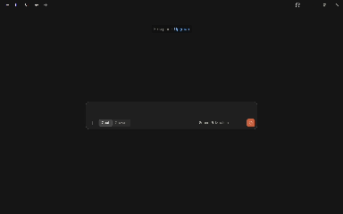

# Pakistan Open Data MCP Server

Ask in plain English, get pointed straight to the exact Pakistani government dataset you need.


An MCP (Model Context Protocol) server that lets AI assistants like Claude search, browse, and retrieve real datasets from [Pakistan's National Open Data Portal](https://opendata.com.pk) — 1,500+ datasets covering health, education, economy, agriculture, demography, and more — without manually browsing and filtering the website.

## Example

> **"Find me datasets about flooding in Pakistan"**

Claude calls this server, searches the live portal, and returns real datasets — rainfall records from LUMS's CHISEL lab, hazard maps from NCBC, and more — with descriptions, publishing organizations, and download links, in seconds.

## What it does

This server exposes 4 tools to any MCP-compatible AI assistant:

| Tool | What it does |
|---|---|
| `search_open_data` | Search datasets by keyword |
| `get_dataset_info` | Get full details of one dataset (description, org, last updated, files) |
| `browse_open_data_by_category` | Browse datasets by category (health, education, economy, etc.) |
| `get_download_links` | Get direct download URLs for a dataset's files |

## Why this exists

Pakistan's open data portal has genuinely useful, real data — but it's not always easy to search or filter well through the website itself. Most existing MCP servers wrap big SaaS platforms (GitHub, Stripe, Notion); this one wraps a smaller, public, regional data source instead.

This is a niche tool for a real audience, not a mass-consumer app:
- Students doing research or thesis work
- Journalists doing data-driven reporting
- NGOs and policy researchers
- Data science / ML students looking for real local datasets to practice on

## What it does *not* do

This server only searches and retrieves — it does **not** read, parse, or analyze the contents of the actual data files (e.g. computing statistics from inside a CSV). That's a deliberate scope decision, left as a separate step outside this server's job.

## How it works

The portal runs on [CKAN](https://ckan.org) (confirmed: version 2.8.3), an open-source data platform with a public, documented REST API — so this server talks to clean structured endpoints, no web scraping involved. Categories on the portal are implemented as CKAN tags rather than the more common "groups" — a detail discovered by direct API exploration during development.

Built with the [official MCP Python SDK](https://github.com/modelcontextprotocol/python-sdk). Includes basic in-memory TTL caching (5 minutes) to avoid hammering the portal's public infrastructure with repeated identical requests, and clear error handling for missing datasets or empty search results.

## Setup

### Option 1: Install as a Claude Desktop Extension (easiest)

1. Download `pakistan-open-data-mcp.mcpb` from this repo
2. Double-click it, or open it via Claude Desktop → Settings → Extensions → Advanced settings → Install Extension
3. Restart Claude Desktop if prompted
4. Start asking questions about Pakistani open data

### Option 2: Run it manually (for development)

Requires Python 3.10+.

```bash
git clone https://github.com/ahsan-rajput/pakistan-open-data-mcp.git
cd pakistan-open-data-mcp
python -m venv venv
venv\Scripts\activate        # Windows
pip install -r requirements.txt
python server.py
```

## Example questions to ask

- "Find me health datasets from Pakistan"
- "What education data is available for Sindh?"
- "Show me trade and import/export datasets"
- "Get me the download links for the rainfall dataset"
- "What datasets exist about household income surveys?"

## Tech stack

- Python 3.10+
- [Official MCP Python SDK](https://github.com/modelcontextprotocol/python-sdk)
- `requests` for HTTP calls to the CKAN API
- Packaged as a Claude Desktop Extension (`.mcpb`) using [MCPB](https://github.com/modelcontextprotocol/mcpb) with the `uv` runtime for dependency-free installation

## License

MIT